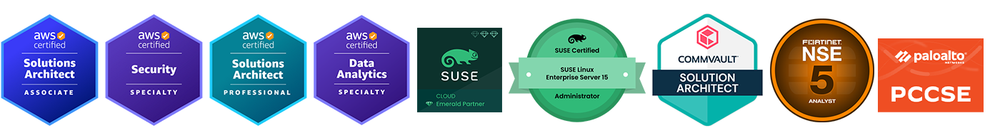

# Hi, I'm RJ.Wang

Senior cloud solutions engineer focused on AWS, Linux, IaC, DevOps, security governance, and GenAI.

I turn real-world customer requirements into practical, scalable, and well-documented cloud solutions.

## What I Focus On
- AWS architecture and technical delivery
- Linux operations, troubleshooting, and automation
- Infrastructure as Code with Terraform and CloudFormation
- Cloud security, governance, monitoring, and audit
- EKS, ECS, Lambda, and serverless solution design
- GenAI integration in enterprise cloud scenarios

## AWS Official Blog Articles
- [Creating CPU usage alerts for EC2 instances in batches](https://aws.amazon.com/cn/blogs/china/creating-cpu-usage-alerts-for-ec2-instances-in-batches/)
- [High-risk operation warning solution based on serverless architecture](https://aws.amazon.com/cn/blogs/china/high-risk-operation-warning-solution-based-on-serverless-architecture/)

## Certifications

  

## Links
- GitHub: [rjwang1982](https://github.com/rjwang1982)
- Knowledge Base: [Yuque](https://www.yuque.com/rjwang1982/kr42ak)
